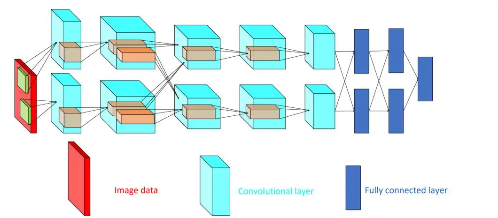

# AlexNet - Image Classification Paper Implementation with ```tensorflow```

AlexNet is a deep convolutional neural network for image classification. The base architecture as per the paper is shown below.



## Key Characteristics
1. Deep Connected Layers with higher parameters.
2. Multi-GPU training for parallel layers.
3. High scale data augmentation for reducing over-fitting.
4. Local Response Normalization for more generic model learning.


## Implemented
1. **Local Response Normalization:**
This is a normalization technique introduced in the base paper. The formula for the normalization is as follows,


$$b_{x,y}^j = \frac {a_{x,y}^j} {k + \alpha \sum_{j=max(0,i-n/2)}^{min(N-1, i+n/2)} (a_{x,y}^j)^2 }$$

Denoting by $a^i_{x,y}$ the activity of a neuron computed by applying kernel i at position $(x, y)$ and then applying the ReLU nonlinearity, the response-normalized activity is $b^i_{x,y}$. where the sum runs over $n$ “adjacent” kernel maps at the same spatial position, and $N$ is the total number of kernels in the layer.  The constants $k, n, \alpha$, and $\beta$ are hyper-parameters whose
values are determined using a validation set; we used $k = 2, n = 5, α = 10^{-4}, $ and $ β = 0.75$.

2. **Own Augmentation Pipeline:** the augmentation pipeline is implemented with a different approach. Check ```augmentation_model``` in code for more details.

3. **Corrected Shapes With Custom ```Padding``` Layer:** Written custom ```Padding``` layer for keeping the shapes correct as per the paper.

4. **Different Optimizer:** The optimizer as per the paper is SGD but I have used Adam for faster converge.

5. **Last Layer Modification:** Changed the dimension of last layer to fit the shape of new dataset with lesser class. The similar thing we do while tuning pre-trained weights.

6. **Weight Initialization:** The weights and biases are initialized with standard normal variable and zeros and ones as mentioned in paper. 