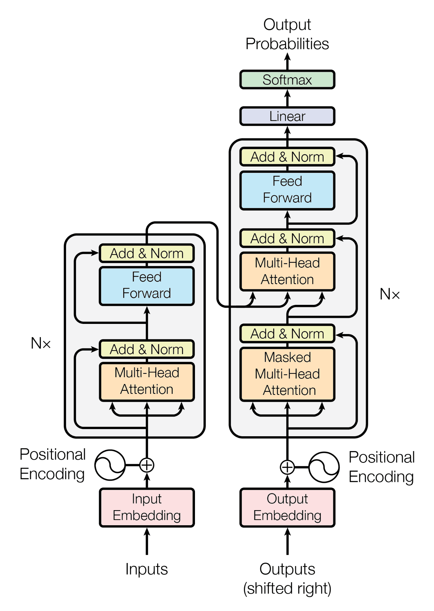

# ✨ Attention is All You Need \~ for ~~Translation~~ **TransLiteration**

An implementation of the [*Attention Is All You Need*](https://arxiv.org/abs/1706.03762) architecture adapted for **Banglish-to-Bengali Transliteration**.

> ⚠️ *Note:* This is not a direct replica of the original paper but an adaptation with modified settings and a different dataset tailored for character-level transliteration.

---

## 🧠 Base Architecture

This project is built upon the Transformer architecture proposed in the original [Vaswani et al. (2017)](https://arxiv.org/abs/1706.03762) paper.

### 🔧 Architecture Overview

<p align="center">  </p>

> The core structure remains consistent with the original transformer, but key hyperparameters and components have been modified to suit the transliteration task.

---

## 🔄 What's Different?

| Component         | Original (Vaswani et al.)         | This Implementation                    |
| ----------------- | --------------------------------- | -------------------------------------- |
| **Task**          | Machine Translation (EN→FR/DE)    | Banglish → Bengali **Transliteration** |
| **Tokenization**  | WordPiece or BPE                  | Character-level                        |
| **Model Dim.**    | 512                               | 128                                    |
| **Dropout**       | 0.1                               | 0.3                                    |
| **Learning Rate** | Custom LR schedule (with warm-up) | Constant LR: `0.001`                   |
| **LR Schedule**   | Warm-up + Linear Decay            | Constant, with Adam optimizer          |

---

## 📦 Dataset

The model was trained on a **custom Banglish-to-Bengali transliteration dataset**, where input is Latin-script Bengali (Banglish), and the output is the corresponding Bengali script.

---

## 🔗 Resources

* 📄 [Attention is All You Need - arXiv 1706.03762](https://arxiv.org/abs/1706.03762)

---

## 📸 Sample Output


```
Input (Banglish): ami tomar sathe jabo
Output (Bengali): আমি তোমার সাথে যাবো
```