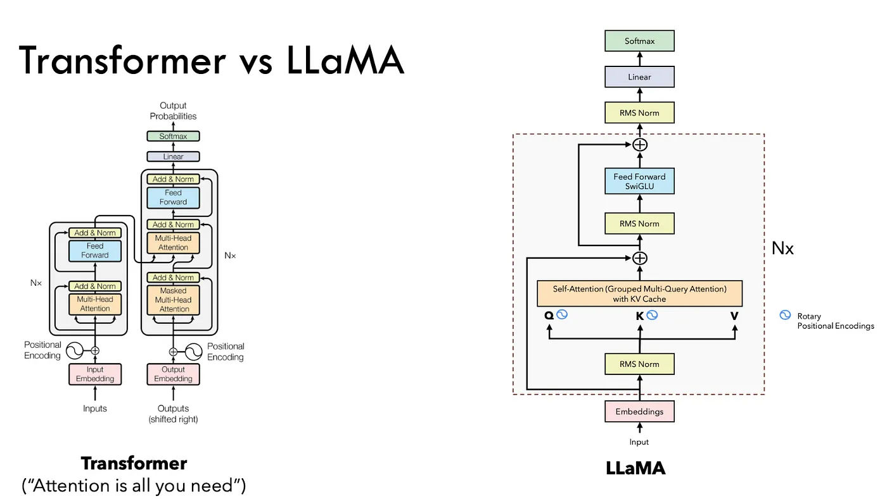

# 🧠 Reasoning‑LLaMA‑Small

A lightweight (~100 M parameter) decoder-only transformer based on LLaMA architecture, fine-tuned on logical reasoning data for chain-of-thought inference. Included as part of the **CodeThatPaper** project.

## 🎯 What's Included

- **End-to-End Training Pipeline**:
  - Loads `KingNish/reasoning-base-20k` dataset via HuggingFace Datasets.
  - Custom tokenizer built on top of `gpt-2` tokenizer using `tiktoken`, with special tokens like:
    - `<|im_start|>`, `<|im_end|>`, `user`, `reasoning`, `assistant`, `<|PAD|>`.
  - Includes padding and EOS handling.
  - Custom `collate_fn` and causal `calculate_mask()` for training autoregressive models.

- **Model Architecture**:
  - Embedding → 6 Decoder Layers → Final RMSNorm → SwiGLU MLP → Linear Projection Head.
  - Designed with efficient components (no bias in layers, RMSNorm over LayerNorm).
  - Implements rotary positional embeddings (RoPE).
  - Scaled dot-product attention with KV-head separation.

- **Transformer Block Components**:
  - `RMSNorm`: Root mean square normalization.
  - `LlamaAttention`: Multi-head attention with rotary embeddings and key/value head sharing.
  - `LlamaMLP`: SwiGLU-based feedforward block.
  - `LlamaDecoder`: A single decoder block combining attention + MLP with skip connections.
  - `Llama`: Full model with stacked decoder layers and generation loop.

- **Tokenizer Customization**:
  - Extends GPT-2 BPE with special tokens for instruction tuning and reasoning format.
  - Encodes and decodes while preserving special symbols using forced decoding override.

## 📚 Dataset

- **Name**: `KingNish/reasoning-base-20k`
- **Size**: ~20,000 examples.
- **Structure**:
  - Each sample has: `user`, `reasoning`, `assistant`, `template`.
  - Examples are templated for instruction-style prompts.
- **Purpose**: Encourage step-by-step chain-of-thought reasoning across mathematics, science, logic, and general problem solving.

## ⚙️ Model & Parameter Summary

| Component               | Configuration                                 |
|------------------------|-----------------------------------------------|
| Vocabulary size        | ~50,000 + custom special tokens               |
| Model dimension (d)    | 768                                           |
| Hidden layers          | 6                                             |
| Heads                  | 8 (with 4 KV‑heads)                           |
| Intermediate dimension | 768                                           |
| Sequence length (max)  | 1,280 tokens                                  |
| Normalization          | RMSNorm (ε = 1e‑6)                            |
| Activation             | SwiGLU (SiLU(x) × Linear(x))                  |
| Parameters             | ≈ 100.2 M                                     |

## 📝 Differences from Base LLaMA

- Smaller scale (6 layers vs. 32+ in full LLaMA).
- No bias terms across layers.
- RoPE applied on attention keys and queries.
- RMSNorm over LayerNorm.
- Uses SwiGLU instead of traditional GeLU.
- Custom tokenizer for reasoning-oriented dialogue formatting.
- Single-token generation and inference interface.

